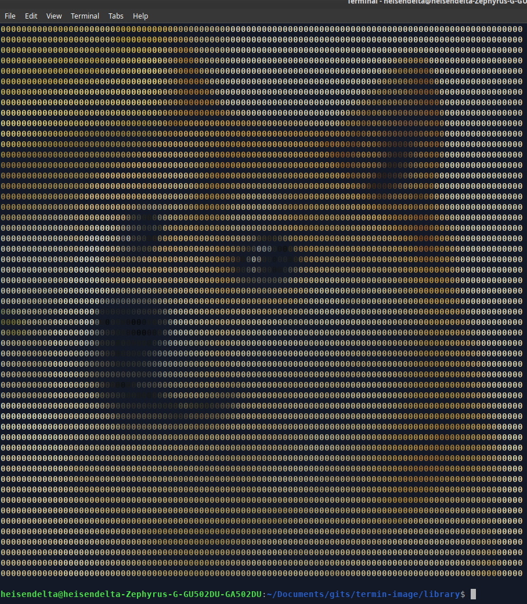

<h1>Termin Image</h1>

    
    

<h2>Description</h2>

    

    

 

Termin Image is an easy python library to render 2D images in the terminal in color and in grayscale.

Note: Color images will only work in the Linux, Mac and new Windows Terminal,

<h2>Libraries</h2>

Termin Image is built using Python 3x and all the external libraries listed below are required to render the images

<ul>
    <li><a href="https://opencv.org/">OpenCV</a></li>
    <li><a href="https://python-pillow.org/">Pillow</a></li>
    <li><a href="https://pypi.org/project/rich/">Rich</a></li>
</ul>

<h2>Usage</h2>

To use the library, first clone into the repository

<pre>
git clone https://github.com/HeisenDelta/termin-image.git
</pre>

Import the Image class and create a new image.

<pre>
from library.main import TerminalImage
from rich.console import Console
console = Console()

image = TerminalImage('PATH')
</pre>

From here, you can print grayscale images ...

<pre>
console.print(image.grayscale(orientation = 'HEIGHT'))
</pre>

Or images in color.

<pre>
console.print(image.color(orientation = 'HEIGHT', details = False))
</pre>

You can even change the character used to print the images (for colored images)

<pre>
image.char_ = '%'
</pre>

Or you can change the background of the image (for colored images)

<pre>
image.backc_ = '#000000'
</pre>
