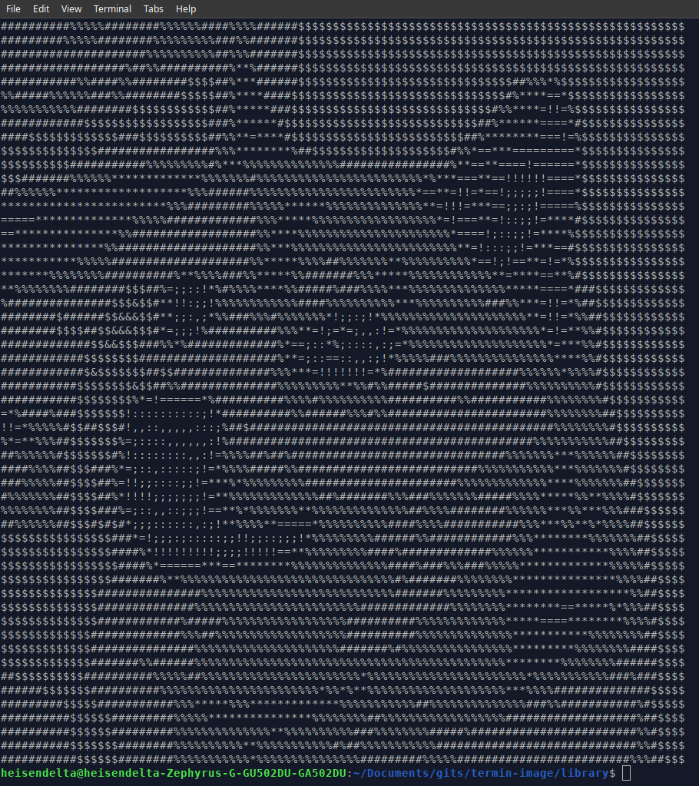

<h1>Termin Image</h1>

    
    

<h2>Description</h2>

Termin Image is an easy python library to render 2D images in the terminal in color and in grayscale.

Note: Color images will only work in the Linux, Mac and new Windows Terminal,

<h2>Libraries</h2>

Termin Image is built using Python 3x and all the external libraries listed below are required to render the images

<ul>
    <li><a href="https://opencv.org/">OpenCV</a></li>
    <li><a href="https://python-pillow.org/">Pillow</a></li>
    <li><a href="https://pypi.org/project/rich/">Rich</a></li>
    <li><a href="https://pypi.org/project/python-dotenv/">Dotenv</a></li>
    <li><a href="https://flask.palletsprojects.com/en/1.1.x/">Flask</a></li>
    <li><a href="http://numba.pydata.org/">Numba</a>&nbsp;(Experimental)</li>
</ul>

<h2>Usage</h2>

To use the library, first clone into the repository

<pre>
git clone https://github.com/HeisenDelta/termin-image.git
</pre>

From here, you can import the Image class and create a new image.

<pre>
from library.main import TerminalImage

image = TerminalImage('PATH_TO_YOUR_IMAGE')
</pre>

You can print grayscale images ...

<pre>
print(image.grayscale(orientation = 'HEIGHT'))
</pre>

Or images in color.

<pre>
from rich.console import Console
console = Console()

console.print(image.color(orientation = 'HEIGHT', details = False))
</pre>

You can even change the character used to print the images (for colored images)

<pre>
image.char_ = '%'
</pre>

Or you can change the background of the image (for colored images)

<pre>
image.backc_ = '#000000'
</pre>

<h2>Environment Variables</h2>

The environment variables define the image path, color, orientation, image name (optional) and scale factor (optional).

The path to the image file can be specified while running the python code from the terminal. (It is stored as a pathlib.Path class)

<pre>
python3 main.py path_to_your_env_file
</pre>

The format of the env file should be in this format. (Note: An example is given in the library folder)
<pre>
PATH_ = path_to_your_image
ORIENTATION = WIDTH
COLOR = True
IMG_NAME = name_of_your_image
FACTOR = 1
</pre>
<ul>

    <li><b>PATH</b>&nbsp;- (required) specifies the path of the image directory.</li>
    <li><b>ORIENTATION</b>&nbsp; - (required) 'WIDTH' or 'HEIGHT' specifies if the image scales to terminal width or height</li>
    <li><b>COLOR</b>&nbsp; - (required) Boolean value for if the image is colored or not</li>
    <li><b>IMG_NAME</b>&nbsp; - Not required if PATH specifies the img name as well. Otherwise this will be appended to PATH</li>
    <li><b>FACTOR</b>*&nbsp; - Resizes the image width the scale factor (defaults to 1.0)</li>

</ul>

<h2>API</h2>

As of now, api/app.py is Flask file that acts as a REST API for localhost. The syntax is listed below:

<pre>
# Loads basic terminal image rendering (main.py)

http://127.0.0.1:5000/main/env?env_path={}
http://127.0.0.1:5000/main/mnl?img_path={}&color={}&factor={}&orient={}

# Loads profile image rendering (profile.py)

http://127.0.0.1:5000/profile/env?env_path={}
http://127.0.0.1:5000/profile/mnl?img_path={}&x={}&y={}&color={}&factor={}
</pre>

<table>
    <thead>
        <th>Parameter</th>
        <th>Value</th>
    </thead>
    <tbody>
        <tr>
            <td>env_path</td>
            <td>(class str) The path to your .env file</td>
        </tr>
        <tr>
            <td>img_path</td>
            <td>(class str) The path to your image file</td>
        </tr>
        <tr>
            <td>color</td>
            <td>(class bool) True for colored images, false for grayscale images</td>
        </tr>
        <tr>
            <td>factor</td>
            <td>(class float) The factor by which the image is scaled</td>
        </tr>
        <tr>
            <td>orient</td>
            <td>('HEIGHT', 'WIDTH') 'HEIGHT' for if the image is scaled by terminal height or 'WIDTH' by terminal width</td>
        </tr>
        <tr>
            <td>x</td>
            <td>(class unsigned int) The x_offset by which the image is shifted to the right in the profile frame</td>
        </tr>
        <tr>
            <td>y</td>
            <td>(class unsigned int) The y_offset by which the image is shifted down in the profile frame</td>
        </tr>
    </tbody>

</table>